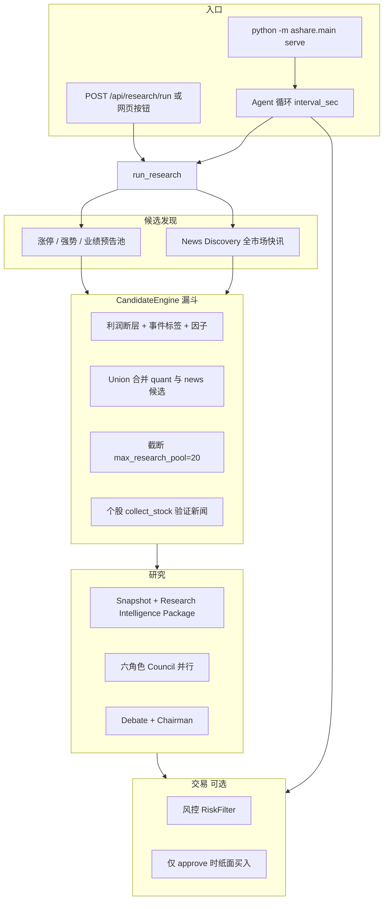

# 龙探雷达 LongTan Radar — 大A龙头智能探查台

**机器找候选 → 新闻/事件规则打分 → AI 多角色研究 → 人做决策。**

面向中国 A 股（日频）的龙头/事件探查、研报生成与纸面交易闭环。默认 **paper 模式**，不会向 QMT/券商下实盘单。

> 开发者说明：Python 包名仍为 `ashare`（`python -m ashare.main`），与产品名「龙探雷达」并存。  
> 东方财富 PC 客户端（如 `D:\eastmoney\dfcf`）仅用于人工看盘，**不是**本项目的行情/新闻 SDK。

---

## 目录

- [产品原则](#产品原则)
- [系统架构](#系统架构)
- [新闻系统（两套引擎）](#新闻系统两套引擎)
- [运行方式：自动 vs 手动](#运行方式自动-vs-手动)
- [LLM 与 Token](#llm-与-token)
- [快速启动](#快速启动)
- [配置说明](#配置说明)
- [目录结构](#目录结构)
- [CLI 与 API](#cli-与-api)
- [测试](#测试)
- [文档索引](#文档索引)
- [注意事项](#注意事项)

---

## 产品原则

| 原则 | 落地 |
|------|------|
| 无未来函数 | T 日收盘信息出信号，T+1 开盘/收盘成交 |
| A 股制度 | 手数 100、卖出印花税、停牌/涨跌停/ST |
| 研究 ≠ 交易 | `research_rating` 与 `trading_action` 分离；新闻 ≠ BUY |
| LLM 不是开关 | 缺 Key 或调用失败走启发式；仍须风控 + 主席 `SMALL_POSITION` 才模拟买 |
| 数据诚实 | 无 as-of 财务/一致预期/行业图时 `available=false`，禁止伪造 PE/PB |
| 新闻不绑死一家 | 百度 + 东财 + 新浪 + 同花顺；单源失败降级 |
| 弱关联不进包 | 个股新闻标题/正文未命中公司名或代码 → 丢弃（`query_weak`） |

更细的模块说明：[`CURRENT_ARCHITECTURE.md`](CURRENT_ARCHITECTURE.md)、[`CURRENT_NEWS_ARCHITECTURE.md`](CURRENT_NEWS_ARCHITECTURE.md)。  
新闻 Discovery 第三版改造记录：[`docs/NEWS_DISCOVERY_ARCHITECTURE.md`](docs/NEWS_DISCOVERY_ARCHITECTURE.md)。  
给外部模型做架构评审：复制 [`PROJECT_FOR_REVIEW.md`](PROJECT_FOR_REVIEW.md)。

---

## 系统架构



### 主流程模块

| 步骤 | 模块 | 说明 |
|------|------|------|
| 1. 股票池 | `pool/builder.py` | 涨停连板 + 强势股 + 业绩预告利润断层；不足时用技术龙头补齐 |
| 2. 新闻发现 | `news/opportunity.py` | 并行扫描新浪/同花顺快讯 → 规则映射 A 股（不产 BUY） |
| 3. 候选合并 | `candidate/` | Quant/Event/Profit ∪ News → 去重 → 统一打分 → 截断 20 只 |
| 4. 因子 | `factors/` | 技术/Leader 截面；as-of 财务缺口标记 `available=false` |
| 5. 个股新闻 | `news/engine.py` | 多源拉取 → 去重 → **关联置信度过滤** → 事件分 |
| 6. ML 提示 | `ml/ranking.py` | LightGBM 超额收益 Walk-Forward（失败则跳过） |
| 7. 投研 | `research/session.py` | 最多 12 只进 Council；快照可复盘 |
| 8. 遗留圆桌 | `ai/roundtable.py` | 四角色投委会（兼容字段与 UI） |
| 9. 交易 | `services/trading.py` | 仅 `committee_approve` 时纸面成交 |
| 10. 优化 | `ai/optimizer.py` | 调因子/池参数；**不读新闻正文** |

**成交规则**：T 日信号 → T+1 成交；100 股整数；卖出含印花税。

---

## 新闻系统（两套引擎）

### A. News Discovery（全市场 → 找新标的）

- 入口：`NewsOpportunityEngine.discover()`
- 数据源：`config/news.yaml` → `discovery.providers`（默认 sina + ths）
- 流程：快讯 → 关键词分类/抽事件 → 代码/全称/别名映射 → `NewsCandidate`
- **规则-only，不调 LLM**（`llm_mapping: false`）
- 映射失败 → `NOT_ENOUGH_EVIDENCE`（宏观/海外标题无 A 股代码时很常见）
- 落盘：`data/news/discovery_latest.json`
- API：`GET /api/news/discovery`

### B. Stock → News（已有候选 → 验证新闻）

- 入口：`NewsIntelligenceEngine.collect_stock(symbol)`
- 数据源：baidu / eastmoney / sina（`config/news.yaml` `providers`）
- 流程：抓取 → 去重 → `link_entities` 校验标题/正文是否含**公司名或 6 位代码**
- **`min_link_confidence: 0.5`**：未命中则丢弃，避免「维峰电子」挂在「汉森制药」名下
- 打包：`last_7d` / `timeline` / `net_event_score` → 进入 Council 证据包
- API：`GET /api/news/{symbol}`

### 研究假设与 Price-In

| 能力 | 模块 | 说明 |
|------|------|------|
| 假设分层 | `research/hypothesis.py` | FACT / INFERENCE / HYPOTHESIS，规则模板 |
| 情报包 | `research/intel_package.py` | Council 统一输入；显式 `data_availability` |
| 价量反应 | `research/price_reaction.py` | 分离 `news_signal` / `price_signal`；`price_in_risk` 仅警告 |
| 来源归因 | `research/tracking.py` | 按 `candidate_sources` 统计 outcome（描述性，不改权重） |

---

## 运行方式：自动 vs 手动

`config/default.yaml`：

```yaml
agent:
  autostart: true      # serve 启动时自动开循环
  interval_sec: 1800   # 默认每 30 分钟一轮
```

| 方式 | 触发 | 做什么 |
|------|------|--------|
| **Agent 自动循环** | `serve` 且 `autostart: true` | 研究 + Discovery + Council + **模拟买入** + 优化 |
| **手动「跑一轮研究」** | 网页按钮 / `POST /api/research/run` | 只跑 `run_research`（Discovery + Council），**不下单** |
| **单轮 Agent** | `POST /api/agent/cycle` | 等同 Agent 一整轮 |

查看状态：`GET /api/agent`（`running` / `cycle` / `phase`）。

若只想手动触发，设 `agent.autostart: false` 并重启 API。

---

## LLM 与 Token

- **Discovery / 新闻映射 / 假设 / Price-In**：规则引擎，**不耗 LLM Token**
- **LLM 仅用于 Council**（最多 `max_council=12` 只股票 × 约 6 次调用/只）
- 输入是压缩后的 `research_intelligence`（假设 ≤12 条、timeline ≤12 条），单次 payload 约 **10k 字符**截断
- 占位 Key（如 `sk-你的密钥`）→ 启发式兜底，前后端仍可启动
- 优化器 **不读新闻**，只根据模拟盘指标调因子权重

多模型配置（一个 Key + 一个 URL，按角色换 model）：

```env
AI_API_KEY=sk-你的密钥
AI_BASE_URL=https://dashscope.aliyuncs.com/compatible-mode/v1
AI_PROVIDER=qwen
AI_MODEL_DRAGON=qwen3.8-max
AI_MODEL_EVENT=deepseek-v4-flash
AI_MODEL_RISK=Moonshot-Kimi-K2.5
AI_MODEL_CHAIR=deepseek-v4-flash
```

改 `.env` 后需 **重启 API**。

---

## 快速启动

**必须使用项目虚拟环境**（系统 Python 找不到 `ashare` 包）：

```powershell
cd D:\bakend\ssh2\lianghua_daA
python -m venv .venv          # 首次
.\.venv\Scripts\Activate.ps1
pip install -e ".[dev]"

copy .env.example .env        # 若有；填入 AI_API_KEY 等
python -m ashare.main db-init # 可选；PG/Redis 连不上也能跑

python -m ashare.main serve     # API http://127.0.0.1:8000

# 另开终端
cd web
npm install                   # 首次
npm run dev                   # http://127.0.0.1:5173
```

### 前端页面

| 页面 | 作用 |
|------|------|
| **总览** | 盈亏曲线、持仓、最近结论 |
| **圆桌研报** | News Discovery 面板、平台研报卡片、新闻与事件、角色论点 |
| **研究循环** | 启动 / 急停 / 重置 Agent |

`autostart: true` 时，首轮会拉池 + K 线 + 新闻 + LLM，约 **1–3 分钟**（无 Key 则圆桌走启发式）。

### `.env` 示例

```env
AI_API_KEY=sk-你的密钥
AI_BASE_URL=https://api.siliconflow.cn/v1
DATABASE_URL=postgresql+psycopg://postgres:密码@127.0.0.1:5432/ashare
REDIS_URL=redis://127.0.0.1:6379/0
BROKER_MODE=paper
```

密钥只放 `.env`，**不要提交 Git**（已在 `.gitignore`）。

---

## 配置说明

| 文件 | 作用 |
|------|------|
| `config/default.yaml` | 策略、池、Agent、AI 网关、纸面账户 |
| `config/research.yaml` | 漏斗 `max_research_pool` / `max_council`、Council 角色 |
| `config/news.yaml` | 新闻源、`discovery` 块、`min_link_confidence`、别名 |
| `config/factors.yaml` | 因子目录与 Leader 权重 |
| `config/prompts.yaml` | Council / 主席 Prompt 版本 |
| `config/models.yaml` | LGBM 与综合评分权重 |

关键项：

| 键 | 含义 |
|----|------|
| `universe.mode: leader` | 龙头/事件池（非全市场回调） |
| `research.enabled: true` | 选股走研究管线（默认） |
| `research.funnel.max_council: 12` | 进 LLM Council 的上限 |
| `news.fetch.min_link_confidence: 0.5` | 个股新闻弱关联丢弃阈值 |
| `news.discovery.enabled` | 是否跑全市场 News Discovery |
| `agent.autostart` / `interval_sec` | 自动循环开关与间隔 |

---

## 目录结构

```
config/                      # YAML 配置
docs/
  NEWS_DISCOVERY_ARCHITECTURE.md
src/ashare/
  pool/                      # 涨停/强势/预告龙头池
  factors/                   # 因子库 + FactorEngine
  profit/                    # 利润断层
  events/                    # 池标签事件 prior
  candidate/                 # Union 漏斗 + 新闻重打分
  news/                      # Provider 注册表 + Discovery + Engine
  research/                  # Session / Council / Snapshot / Hypothesis / Price-In / Tracking
  ml/                        # LightGBM 排序 + 遗留训练
  ai/                        # LLM Client / 圆桌 / 优化器
  services/                  # research / agent / trading / picks
  backtest/                  # T+1 回测引擎
  api/                       # FastAPI
web/                         # React + Vite 前端
data/
  reports/                   # latest.json 研报
  research_snapshots/        # 可复盘快照
  news/                      # discovery_latest.json + raw jsonl
  cache/daily/               # AkShare 日线 parquet
tests/                       # pytest（含 News Discovery v3 验收清单）
```

**行情源**：`data.provider=akshare`（日线缓存）；`sample` 可离线调试。  
**数据缺口**：as-of 估值/质量/一致预期/行业图未接入时对应字段 `available=false`。

---

## CLI 与 API

### CLI

```powershell
.\.venv\Scripts\Activate.ps1
python -m ashare.main research    # 只出研报
python -m ashare.main serve       # API + 可选 autostart
python -m ashare.main agent       # 单轮：研究 + 交易 + 优化
python -m ashare.main backtest    # strategy.name=leader
python -m ashare.main reset       # 重置纸面账户
```

### 主要 HTTP API

| 方法 | 路径 | 作用 |
|------|------|------|
| GET | `/api/health` | 健康检查 |
| GET | `/api/research/latest` | 最新研报（含 discovery / union / outcomes） |
| POST | `/api/research/run` | 手动跑一轮研究 |
| GET | `/api/news/discovery` | 最近一次 News Discovery |
| GET | `/api/news/{symbol}` | 个股新闻包 |
| GET | `/api/research/candidates` | Union 候选（含 sources / reject） |
| GET | `/api/research/hypotheses` | 研究假设列表 |
| GET | `/api/research/outcomes` | 跟踪 outcome |
| GET | `/api/research/attribution` | 按 discovery 来源归因 |
| GET | `/api/research/sessions` | 研究会话索引 |
| GET | `/api/agent` | Agent 状态 |
| POST | `/api/agent/start` | 启动循环 |
| POST | `/api/agent/stop` | 急停 |
| POST | `/api/agent/cycle` | 只跑一轮 Agent |
| GET | `/api/pnl` | 盈亏与持仓 |

---

## 测试

```powershell
.\.venv\Scripts\Activate.ps1
pytest tests/ -q
```

重点套件：

- `test_news_intelligence.py` — 去重、弱关联、as-of 过滤、**个股新闻置信度过滤**
- `test_news_discovery.py` / `test_news_discovery_v3_checklist.py` — Discovery 映射与验收清单
- `test_candidate_union.py` — Quant ∪ News 漏斗
- `test_hypothesis.py` / `test_intel_package.py` / `test_price_reaction.py`
- `test_attribution.py` / `test_phase10_research_cycle.py` — 离线研究循环契约

测试不依赖外网 Provider（使用 fixture / monkeypatch）。

---

## 文档索引

| 文档 | 内容 |
|------|------|
| [`PROJECT_FOR_REVIEW.md`](PROJECT_FOR_REVIEW.md) | 给外部 LLM 的完整架构说明（自包含） |
| [`CURRENT_ARCHITECTURE.md`](CURRENT_ARCHITECTURE.md) | 模块与数据流 |
| [`CURRENT_NEWS_ARCHITECTURE.md`](CURRENT_NEWS_ARCHITECTURE.md) | 新闻 Provider 与引擎 |
| [`docs/NEWS_DISCOVERY_ARCHITECTURE.md`](docs/NEWS_DISCOVERY_ARCHITECTURE.md) | Discovery 第三版 Phase 0–10 审计与落地记录 |

---

## 注意事项

1. 首轮研究需拉池 + K 线 + 新闻 + 多次 LLM，约 1–3 分钟；Agent 运行中请勿重复狂点「跑一轮研究」。  
2. Discovery 快讯多为宏观/海外标题时 **`n_candidates=0` 正常**，不代表系统故障。  
3. 个股「新闻与事件」经 **关联过滤** 后可能变短或为空 — 优于展示错绑新闻。  
4. 现金不足 1 手时跳过买入，研报仍保留。  
5. 历史回测无法复现实时涨停/预告/新闻接口；`LeaderFactorStrategy` 用技术因子代理。  
6. 实盘 QMT 需自行配置，Agent 不会自动打开实盘。  
7. 同花顺 7×24（`ths`）仅作 **全市场 Discovery**，不作个股新闻源。

---

## License

内部研究用途。部署前请自行评估数据源合规性与 AI 输出风险。
